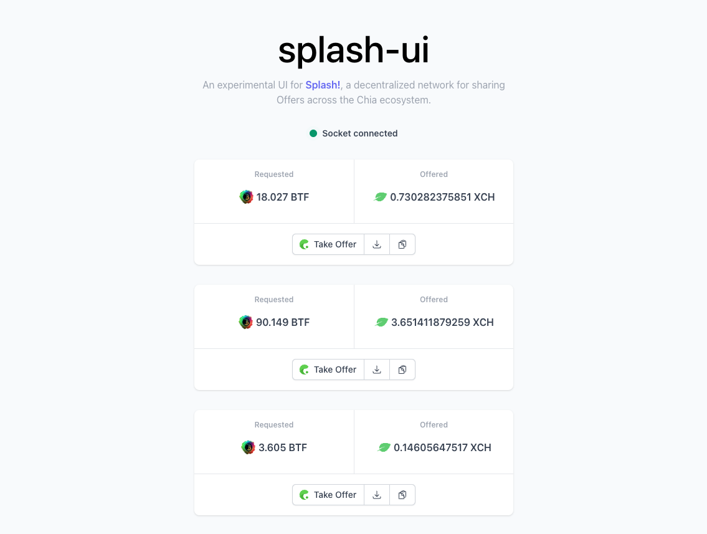

# splash-ui

An experimental UI for [Splash!](https://github.com/dexie-space/splash), a decentralized network for
sharing [Chia offers](https://chialisp.com/offers/)
across the ecosystem.



## Setup

Make sure to install the dependencies:

```bash
# yarn
yarn install

# npm
npm install

# pnpm
pnpm install --shamefully-hoist
```

## Development Server

Start the development server on http://localhost:3000

```bash
npm run dev
```

## Production

Build the application for production:

```bash
npm run build
```

Locally preview production build:

```bash
npm run preview
```

## Connect to Splash!

To connect to Splash!, download the latest release for your operating system
from [GitHub](https://github.com/dexie-space/splash/releases).

Then connect it to the UI using the following command:

```bash
./splash --offer-hook http://localhost:3000/api/offer
```

All incoming offers should now show up in the UI!